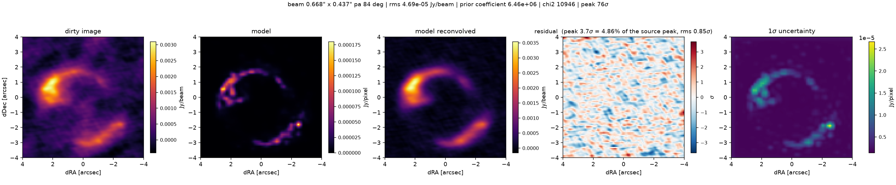
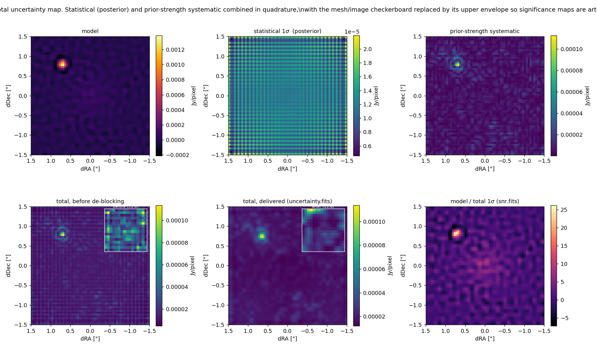
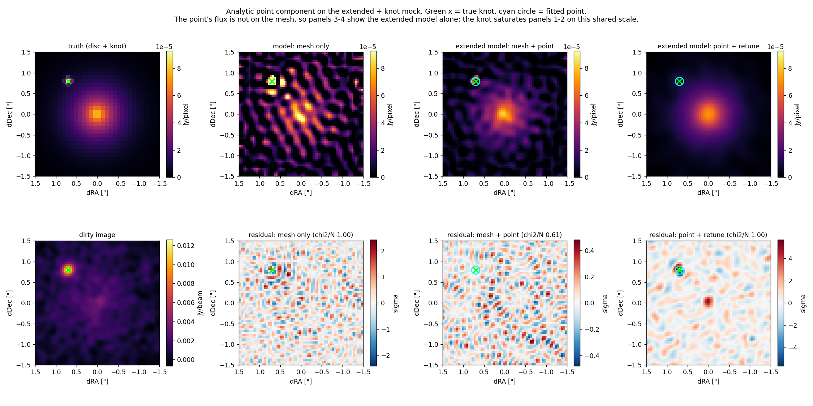

# pyuvimage

Easy image reconstruction of radio interferometric data by **forward modelling
in the uv-plane**. A lightweight alternative to CLEAN for people who want a
regularised maximum-likelihood image with honest residuals and honest error
bars, without being an interferometry expert and without heavy compute.

Built using [PyAutoGalaxy](https://github.com/PyAutoLabs/PyAutoGalaxy) and [PyAutoGalaxy](https://github.com/PyAutoLabs/PyAutoArray)
tools: the sky is a freeform image on a
cartesian grid, solved by a linear inversion under a Gaussian-process source
prior whose hyperparameters are optimised automatically — so the model fits to
the noise level rather than through it, with nothing to tune by hand.

## Install

```bash
pip install -e .            # core (numpy backend)
pip install -e ".[ms]"      # + python-casacore, to read measurement sets
pip install -e ".[jax]"     # + JAX/nufftax (optional)
```

Python ≥ 3.12. JAX is optional and the NumPy path is fully supported, but on
datasets above 5000 visibilities it is what lets `--inversion auto` take the
sparse path, which is where the memory ceiling comes off — without it every
fit uses the dense mapping matrix. See [docs/install.md](docs/install.md),
which also covers building an **arm64** conda environment on Apple silicon,
the one setup detail whose symptoms otherwise appear much later.

## Use

```bash
# one-off: convert the measurement set (calibrated data, one field)
pyuvimage import obs.ms mydata/            # spw 0
pyuvimage import obs.ms mydata/ --spw all  # or every spectral window

# reconstruct — fov must cover ALL the emission in the field
pyuvimage fit mydata/ --fov 3.0
```

No python-casacore? Export from CASA with the bundled script and fit the `.npz`
directly:

```bash
# field 0, spw 0; spw may also be a list (0,2), a range (0-3), or "all"
casa --nologger --nogui -c src/pyuvimage/casa_export.py obs.ms mydata.npz 0 all
pyuvimage fit mydata.npz --fov 3.0
```

Or from Python:

```python
import pyuvimage
result = pyuvimage.run("mydata/", fov=3.0, mode="cube")  # or "mfs" (default)
```

Try it with no data at all: `pyuvimage demo`.

## Outputs

All FITS, all on one grid at one pixel scale, WCS from the MS phase centre.

| file | unit | content |
|---|---|---|
| `model.fits` | Jy/pixel | the reconstructed sky (apparent, i.e. PB-attenuated) |
| `model_pbcor.fits` | Jy/pixel | primary-beam-corrected model |
| `model_reconvolved.fits` | Jy/beam | model ⊗ fitted Gaussian beam + residuals — the CLEAN-image analogue |
| `model_reconvolved_pbcor.fits` | Jy/beam | primary-beam-corrected version of it |
| `residual.fits` | σ | (data − model) dirty image / rms (rms in header `RMS`) |
| `uncertainty.fits` | Jy/pixel | total 1σ per pixel — see below |
| `snr.fits` | — | `model / uncertainty`, ready to use as a significance map |
| `dirty_image.fits` | Jy/beam | naturally weighted dirty image of the data |
| `dirty_model.fits` | Jy/beam | dirty image of the model visibilities |
| `pb.fits` | — | primary beam (Gaussian, FWHM ≈ 1.13 λ/D), centred on the phase centre — not on the image centre when `--image-centre` is used |

Plus `summary.png`, `fit_parameters.json` (every parameter of the run),
`prior_scan.json` (every hyperparameter trial), and `point_sources.json` when
point components are fitted.



PJ0116 at 245 GHz, an ALMA Band 6 observation of a lensed source (5158
visibility samples, `--fov 8`): the arc and its counter-image at χ²/N = 1.007,
a residual peaking at 3.7σ — 5% of the source peak — and a featureless residual
map, which is what you want to see. The model panel is in Jy/pixel and the
reconvolved panel in Jy/beam, which is why they look so different: the model is
the sky at the mesh scale, not smoothed by the beam.

## The settings worth knowing about

`--fov` is the only required input; everything else has a default that is meant
to be left alone. These are the ones worth reaching for:

| flag | when |
|---|---|
| `--reg gibbs` | a single bright compact feature you want as sharp as possible |
| `--reg gaussian` | very sparse visibilities, where a stationary prior lets sidelobes leak into the model |
| `--point-sources` | there is a genuine point source in the field — no pixel grid can represent one |
| `--image-centre auto` | the source is not at the phase centre. Recentring on it is exact and cost falls as the *square* of the field you then need |
| `--pixel-scale nyquist` | you want the longest baselines sampled — finer mesh, several times slower, and only worth it if the long baselines are well populated |
| `--criterion structure` | rarely — `auto` already picks this on any well-constrained fit. Force it if the structure ratio the run prints is far from 1 while `chi^2/N` looks fine |
| `--criterion evidence` | the fit looks over-smoothed at a bright peak *and* you have fewer visibilities than model pixels |
| `--inversion dense` | you want the long-established path on a big dataset. `auto` (the default) switches to the sparse w-tilde inversion above 5000 visibilities, which is where the dense mapping matrix starts to dominate — see [Run time and memory](#run-time-and-memory). The sparse path is new; force `dense` if you want to compare |
| `--mode cube` | per-channel images instead of one MFS image. The shared prior is fitted on a 1-in-`n_chan` subset by default (`--cube-prior`), which is what makes a cube affordable — see [docs/parameters.md](docs/parameters.md#what-the-cubes-shared-prior-is-fitted-on) |

Full reference: [docs/parameters.md](docs/parameters.md).

## Choosing the prior (`--reg`)

The source prior is what stops the inversion fitting noise. All of these are
Gaussian-process priors on the mesh, `H = coefficient × C^-1`; they differ in
whether `C` varies across the image, and how.

| `--reg` | what it is | when to use it |
|---|---|---|
| `adaptive` **(default)** | two-stage: a first-pass model becomes a brightness map, and the prior's *amplitude* follows it as `b^power` | general use — the best extended model, and no central artefact |
| `gibbs` | non-stationary Matérn: the correlation *length* shortens where the source is bright | sharpest on a single compact feature; leaves a central residual on extended sources |
| `matern` | stationary Matérn covariance, correlation length = the synthesised beam | smooth sources, and the fastest — one pass instead of two |
| `gaussian` | `matern` modulated by a Gaussian envelope on the prior width | sparse visibilities, where a stationary prior lets sidelobes leak in |
| `exponential` | `matern` with ν = 0.5 — rougher | when the source has genuine sharp edges |
| `constant` | nearest-neighbour gradient penalty, no covariance | rarely: rank-deficient, and its evidence is ill-behaved |

The strength (`--lambda`) and correlation length (`--scale`) are optimised for
you; `--adapt-power` sets the exponent for `adaptive` and `gibbs`, `--nu` the
Matérn smoothness. Comparisons across three mocks are in
[docs/priors.md](docs/priors.md).

**How the strength is chosen** is `--criterion`, and the default `auto`
decides for you. `structure` drives the residual *map* to white, which is what
"the fit is done" actually means, and it is what you want on any fit where the
data comfortably outnumber the model — but it is not calibrated when they do
not, so `auto` uses it above 10 data points per mesh pixel and `chi^2 = N`
below, and says in the log which it took. On three real ALMA datasets spanning
30× in visibility count, `--reg adaptive` at structure ratio 1.0 leaves a
residual of 3.9–5.0σ; see [docs/design-notes.md](docs/design-notes.md).

## The uncertainty map

`uncertainty.fits` is the total 1σ per pixel, so `snr.fits` (written for you)
is directly usable as a significance map. Two terms, added in quadrature, with
the median of each in the FITS header:

| term | header key | what it answers |
|---|---|---|
| statistical | `ERRSTAT` | how well the data pin this pixel down, given the prior |
| prior systematic | `ERRSYS` | how much the answer depends on *how strongly* you smoothed |

The statistical term is the closed-form posterior width `sqrt(diag(M C M^T))`
with `C = (F+H)^-1`, verified against Monte Carlo at 0.996. That term alone is
optimistic — a regularised model is smoothed, hence biased — so the systematic
term measures how far each pixel moves when the regularisation strength is
varied over ±0.5 dex. Neither covers the prior *family* being wrong, nor
calibration or deconvolution error.

**Do not add per-pixel errors in quadrature**: they are correlated over the
prior's correlation length. Use `SingleFit.aperture_uncertainty(region)`, which
evaluates `w^T (M C M^T) w` properly — quadrature overstated a compact
aperture's error by ~1.4× on our mocks.



Details, and the mesh/image checkerboard removal recorded as `ERRDEBL`:
[docs/uncertainty.md](docs/uncertainty.md).

## True point sources

A genuine point source is the one thing a pixel grid cannot represent: on our
test data a nearest-pixel delta half a pixel off-centre misrepresents it at
chi^2/N = 31.5. `--point-sources` instead adds analytic delta components whose
amplitudes are solved **in the same linear system** as the mesh.

```bash
pyuvimage fit mydata/ --fov 3.0 --point-sources     # auto-detect
pyuvimage fit mydata/ --fov 3.0 --point 0.70,0.80   # you supply the position
```

Opt-in and deliberately conservative: detection is a matched filter over the
whole field, not a residual peak-finder, and a candidate must clear a
significance cut *and* be positive, at least 0.75 beams from any other
candidate, and genuinely unresolved. Across the generalisation suite this gave
**zero false positives**. Fluxes and 1σ errors land in `point_sources.json`.

Fitting is refused outright if the pixelized model has not converged to its
chi^2 target, because the residual is then model error rather than sky.



Details: [docs/point-sources.md](docs/point-sources.md).

## Several spectral windows

`--spw` on import takes one window (`0`), a list or range (`0,2`, `0-3`), or
`all`; they are imported into one dataset and imaged together. `--mode mfs`
(the default) fits them as one frequency-independent image, `--mode cube` fits
each channel separately.

```bash
pyuvimage import obs.ms mydata/ --spw all
pyuvimage fit mydata/ --fov 3.0 --mode mfs
```

MFS across a wide band mis-models a source with a spectral index, so the import
warns above 20% fractional bandwidth. Details, and how irregular cube
frequencies are written:
[docs/spectral-windows.md](docs/spectral-windows.md).

## Troubleshooting

**Install problems** — `ModuleNotFoundError: No module named 'pyuvimage'` from
the `pyuvimage` script itself, an editable install pointing at a moved
directory, or the console script and the package living in different
environments: [docs/install.md](docs/install.md).

**An x86 Python on Apple silicon cannot run JAX at all.** Every x86 `jaxlib`
wheel is built with AVX, which Rosetta does not provide. Check with
`python -c "import platform; print(platform.machine())"` — you want `arm64`,
not `x86_64` — and if it is wrong, build a native environment:

```bash
CONDA_SUBDIR=osx-arm64 conda create -n native_env python=3.12
conda activate native_env
conda config --env --set subdir osx-arm64   # keeps later installs arm64 too
pip install -e ".[jax]"
```

**`AttributeError: partially initialized module 'jax' has no attribute
'version'`**, or any other crash mentioning jax. Your JAX install is broken,
not pyuvimage: the PyAuto libraries decide whether JAX exists by looking for it
on disk rather than importing it, so a broken install passes that check and
then fails deep inside a fit. pyuvimage detects this at startup, falls back to
the NumPy path, and tells you. To fix JAX itself:

```bash
python -c 'import jax; print(jax.__version__)'   # see the real error
pip uninstall -y jax jaxlib jax-metal
pip install -U 'jax[cpu]'                        # a matched jax/jaxlib pair
```

A jax/jaxlib mismatch is the usual cause; the `jax-metal` plugin and mixing
conda-forge with pip installs each do it too. If you would rather not use JAX,
`pip uninstall jax jaxlib` is a clean answer.

## Run time and memory

Two paths, chosen by `--inversion auto` at 5000 visibilities:

| | limited by | Ruby at 200 GHz (148k samples, 26×26 mesh) |
|---|---|---|
| **sparse** (≥5000 vis) | `--mesh`, as `n_mesh²` | ~1.1 GB, independent of visibility count |
| **dense** (below, or forced) | `n_vis × n_mesh`, per trial | 3.8 GB, rising to ~32 GB at Nyquist |

Sparse needs JAX; `auto` falls back to dense and says so when it is missing,
when `--point-sources` is requested, or when the real and imaginary noise
differ by more than 5%. On the dense path `pip install pynufft` is what makes
it fast. A full fit is roughly 30–40 hyperparameter trials, doubled for the
default `adaptive` prior; Ruby above is ~30 s sparse and tens of minutes dense.

**Two levers, in order of effect:**

1. **Average the data down first**, up to the point where bandwidth and
   time-average smearing set in. A modern dataset carries far more channels
   and time samples than a small field needs — see
   [docs/large-datasets.md](docs/large-datasets.md#averaging-the-data-down).
2. **Recentre on the source** (`--image-centre`). Cost goes as `fov²`, so
   reaching a source from the phase centre is expensive: Ruby at `--fov 8`
   needs ~32 GB at Nyquist on the dense path, and the same data recentred at
   `--fov 3` needs ~4.4 GB *at the same resolution*.

Making the output products finer is nearly free either way — the image size is
not in either scaling law.

## Noise

**pyuvimage estimates the noise from the visibilities themselves and does not
use the MS weights for it.** `SIGMA` and `WEIGHT` are nominally absolute but in
practice only relative, and `split`, `mstransform` and averaging rescale them
again — so a weight column off by 40% quietly changes χ², the smoothing
criterion and `uncertainty.fits` alike.

Instead the estimate differences visibilities adjacent in time on the same
baseline, so the sky cancels and what is left is noise. It is made **once**,
when the data leaves the measurement set, and stored — fits never recompute it.
`--noise difference` (the default) needs nothing but the visibilities; three
alternatives use the weight column to varying degrees, and every import prints
diagnostics saying whether your data would benefit. To change the estimate on
an existing dataset without re-exporting:

```bash
pyuvimage convert export.npz mydata/ --noise difference
```

Full discussion: [docs/noise.md](docs/noise.md).

## How it works

1. **Import** forms Stokes I from the parallel hands (respecting flags) and
   **recomputes the per-visibility noise from the data** (σ = std(diff)/√2).
   The MS weight column is never trusted for scale.
2. **MFS** fits all channels jointly, each with its exact uv coordinates in
   wavelengths (no channel-averaging approximation). **Cube** mode fits each
   channel with the regularisation frozen from an MFS fit.
3. The **inversion** solves `(F + H)s = D` on a rectangular source mesh, with
   the prior's hyperparameters optimised first by the fast unconstrained
   solver, then the coefficient re-bisected with the constrained solver so the
   delivered model fits to the noise level rather than through it. `F` is
   built either from the dense `n_vis × n_mesh` mapping matrix or, above 5000
   visibilities, by the sparse w-tilde formalism — one streaming pass over the
   visibilities onto a fixed-size kernel, the same idea as CASA's `tclean`
   gridding, which takes the data size out of the memory bill.
4. **Products**: the restoring beam is a Gaussian fitted to the dirty beam;
   dirty images are naturally weighted and normalised so the dirty beam peaks
   at 1 (→ Jy/beam); the image rms is analytic (`1/√(Σw)`), verified against
   Monte Carlo.

## Caveats

- Only Stokes I is currently supported.
- Only a single field is currently supported; several spectral windows can be
  imaged together ([docs/spectral-windows.md](docs/spectral-windows.md)).
- The w-term is neglected (small-field approximation), so very large fields are
  not supported.
- Total flux cannot be resolved beyond the maximum recovery scale of the data
  set, which is determined by the baseline length distribution: emission
  resolved out by the array cannot be recovered (same as CLEAN).
- The sparse (w-tilde) inversion that `--inversion auto` selects above 5000
  visibilities is **new**. It agrees with the dense path to 3e-8 on the
  built-in mock (`python scripts/compare_inversions.py --mock`), but that mock
  is small enough to use the DFT; the pynufft path that real datasets take has
  not been compared head-to-head. If a result matters, check it against
  `--inversion dense` — the same script does this on your own data.
- Positivity applies to the mesh-only solve. With `--point-sources` the
  bordered system is eliminated by an unconstrained Cholesky solve, so the
  delivered mesh may hold small negative values whatever `--enforce-positive`
  is set to; the point amplitudes are unaffected.

## Further reading

| doc | what is in it |
|---|---|
| [docs/install.md](docs/install.md) | installing, arm64 conda environments, and the install failures that look like bugs |
| [docs/parameters.md](docs/parameters.md) | every flag, with defaults |
| [docs/noise.md](docs/noise.md) | why the MS weights are not trusted, the four estimators, and the diagnostics that pick between them |
| [docs/priors.md](docs/priors.md) | what each prior is, and how they compare across three mocks |
| [docs/uncertainty.md](docs/uncertainty.md) | the uncertainty map in full, with the Monte Carlo validation |
| [docs/point-sources.md](docs/point-sources.md) | how delta components are solved, and the detection guards |
| [docs/spectral-windows.md](docs/spectral-windows.md) | multiple spw, MFS bandwidth limits, irregular cube frequencies |
| [docs/large-datasets.md](docs/large-datasets.md) | 10^5 visibilities: which NUFFT, where the memory goes, and finding the source before choosing `--fov` |
| [docs/generalisation.md](docs/generalisation.md) | the generalisation suite: a crowded field, four arrays, three noise levels |
| [docs/design-notes.md](docs/design-notes.md) | the grid trap, reading the residual map, under-constrained fits, and other things that bite |

## Development

`python -m pytest tests/` — 307 tests, including end-to-end regressions on
simulated data (adjoint consistency, flux conservation, WCS, restore centring,
the noise estimator, and one test per bug listed in the docs above).
