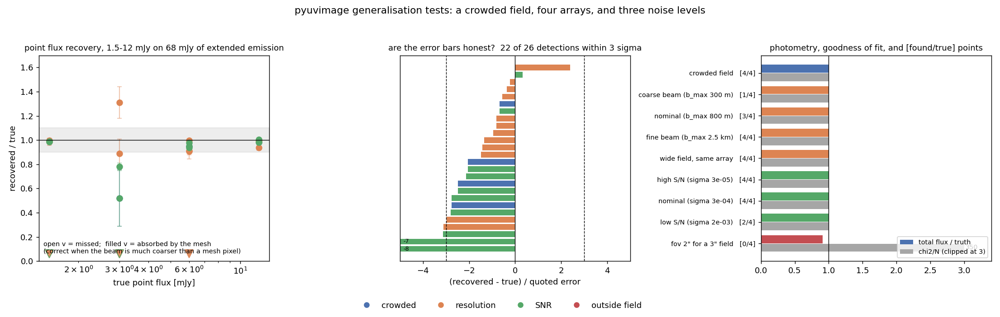
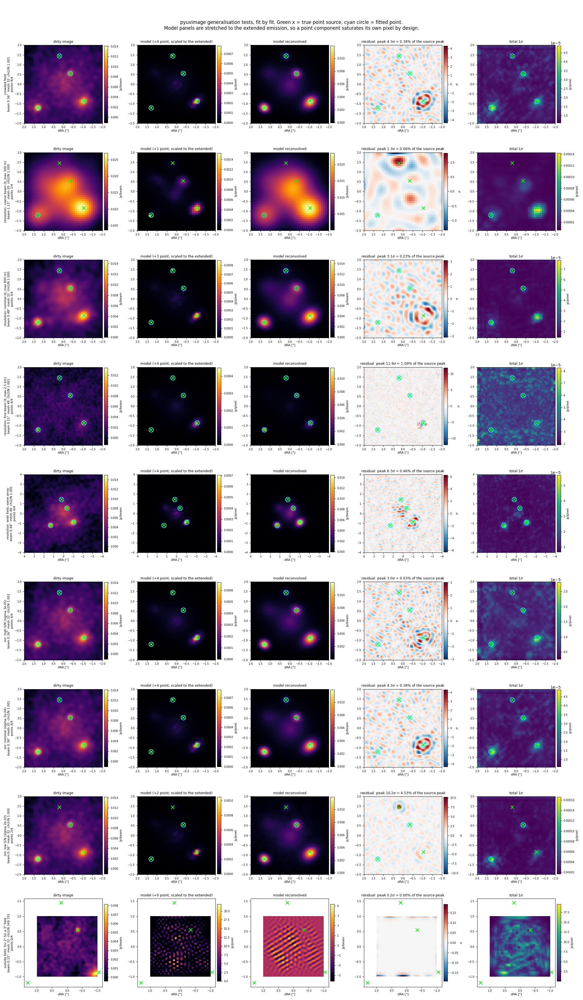

# pyuvimage

Easy image reconstruction of radio interferometric data by **forward
modelling in the uv-plane**. A lightweight alternative to CLEAN for users who
want a regularised maximum-likelihood image with honest residuals, without
being an interferometry expert and without heavy compute.

Built on [PyAutoGalaxy](https://github.com/PyAutoLabs/PyAutoGalaxy)'s
pixelized-source inversion (developed for gravitational lens modelling, used
here with the lens equation switched off): the sky is a freeform image on a
cartesian grid, solved by a linear inversion under a Gaussian-process source
prior (PyAutoLabs' Matérn kernel) whose hyperparameters are optimised
automatically — so the model fits to the noise level rather than through it,
with no knobs to tune.

## Install

```bash
pip install -e .            # core (numpy backend)
pip install -e ".[ms]"      # + python-casacore, to read measurement sets
pip install -e ".[jax]"     # + JAX/nufftax: strongly recommended above ~10^4 vis
```

Python ≥ 3.12 is required by current PyAutoGalaxy releases (3.11 works with
`version: python_version_check: False` in a local `config/general.yaml`).

## Use

```bash
# one-off: convert the measurement set (calibrated data, one field/spw)
pyuvimage import obs.ms mydata/

# reconstruct — fov must cover ALL the emission in the field
pyuvimage fit mydata/ --fov 3.0
```

No python-casacore? Export the target data from CASA with the bundled script, then fit the `.npz` directly:

```bash
casa --nologger --nogui -c src/pyuvimage/casa_export.py obs.ms mydata.npz
pyuvimage fit mydata.npz --fov 3.0
```

Or from Python:

```python
import pyuvimage
result = pyuvimage.run("mydata/", fov=3.0, mode="cube")  # or "mfs" (default)
```

Try it with no data at all: `pyuvimage demo`.

### Outputs (all FITS, with WCS from the MS phase centre)

| file | unit | content |
|---|---|---|
| `model.fits` | Jy/pixel | the reconstructed sky (apparent, i.e. PB-attenuated) |
| `model_pbcor.fits` | Jy/pixel | primary-beam-corrected model |
| `model_reconvolved.fits` | Jy/beam | model ⊗ fitted Gaussian beam + residuals (the CLEAN-image analogue) |
| `dirty_image.fits` | Jy/beam | naturally weighted dirty image of the data |
| `dirty_model.fits` | Jy/beam | dirty image of the model visibilities |
| `residual.fits` | σ | (data − model) dirty image / rms (rms in header `RMS`) |
| `model_reconvolved_pbcor.fits` | Jy/beam | primary-beam-corrected reconvolved model |
| `pb.fits` | — | primary beam (Gaussian, FWHM ≈ 1.13 λ/D) |
| `uncertainty.fits` | Jy/pixel | per-pixel **total** 1σ on the model (see below) |
| `snr.fits` | — | model / total 1σ |

plus `point_sources.json` when point components are fitted (positions,
fluxes, 1 sigma errors), `summary.png` (dirty / model / reconvolved / residual /
uncertainty, each with a colour bar;
the residual panel states its peak and rms in sigma), `prior_scan.json` (every hyperparameter trial with its
evidence and chi^2) and `fit_parameters.json` (every parameter of the run).

### The uncertainty map

One map, `uncertainty.fits`, in Jy/pixel: the best total 1σ per pixel the fit
can estimate, so that `model.fits / uncertainty.fits` (written for you as
`snr.fits`) is directly usable as a significance map.

**What goes into it.** Two terms, added in quadrature, with the medians of
each written to the FITS header so you can see the split without recomputing
anything:

| term | header key | what it is | how it is obtained |
|---|---|---|---|
| statistical | `ERRSTAT` | how well the data pin this pixel down, given the prior | `sqrt(diag(M C M^T))` with `C = (F+H)^-1`, the closed-form posterior covariance |
| prior systematic | `ERRSYS` | how much the answer depends on *how strongly* you smoothed | how far the pixel moves when the regularisation strength is varied over ±0.5 dex |
| | `ERRSPRD` | (records the ±dex used) | |
| | `ERRDEBL` | (records that the checkerboard was removed) | |

Rule of thumb from the mocks: the statistical term dominates in smooth
extended emission, the systematic dominates on compact features — which is
exactly where the prior is doing the most work and where a purely statistical
error bar would mislead you. On the demo the medians are 1.7e-6 and 1.0e-6
Jy/pixel respectively.

In detail:

**Statistical.** The inversion is linear with a Gaussian prior, so the
posterior covariance is closed-form, `C = (F + H)^-1`, propagated to the image
grid as `sqrt(diag(M C M^T))` — not by copying per-mesh-pixel errors across,
since the mapper interpolates and neighbouring mesh errors are correlated. The
noise-only part of this, `(F+H)^-1 F (F+H)^-1`, was verified at **0.996**
(matern) and **0.995** (gibbs) against 30-realisation Monte Carlos.

**Prior systematic.** `C` contains no data and is conditional on one prior at
one strength, which makes it optimistic: a regularised model is smoothed, so
it is biased, and on the extended+compact mock the smoothing bias is ~2.8x the
random scatter. The systematic term measures how far each pixel moves when the
regularisation strength is varied over ±0.5 dex — the same construction used
for point-source fluxes, where it turned pulls of up to 24σ into pulls under
3. It concentrates where it should: around compact features, where the prior
is doing the most work.

It does **not** cover the prior *family* being wrong, nor calibration or
deconvolution error. Nothing cheap does.


**The checkerboard is removed.** Products live on a grid `oversample`× finer
than the model mesh, and the mapper interpolates: a pixel on a mesh node
inherits one mesh pixel's variance, a pixel between nodes is a weighted average
of several and has a genuinely smaller one. Both numbers are right, but the
alternating pattern is an artefact of the two grids and it lands straight in
any significance map — measured at **55%** peak-to-peak within a block on the
test mock. The delivered map replaces it with its upper envelope (a block
maximum, then a block mean), bringing it to **11%**. This is deliberately the
conservative direction: an over-stated error never manufactures a detection.
`ERRDEBL` records that it was done.

**Why the map looks the way it does.** With the prior held fixed the
statistical term is *identical* for completely different datasets (verified to
exactly zero difference) and **cannot respond to how bright the source is**.
Its structure comes from the uv coverage and noise (through `F`), the prior
(through `H`), and the mask edges. A **stationary** prior (`matern`,
`exponential`) makes both translation-invariant and the term is flat by
construction — a featureless matern map is the correct answer, not a bug. A
**non-stationary** prior (`gibbs`, `adaptive`, `gaussian`) varies: on the
extended+compact mock the gibbs map peaks 5x its median at the unresolved knot,
with a 6x range across the field, and the Monte Carlo reproduces that
structure. The knot has the *larger* error bar because the prior is
deliberately weakest there. The systematic term, by contrast, does respond to
the source — it is a difference of two fits.

**Do not add per-pixel errors in quadrature.** The covariance is strongly
correlated over the prior's correlation length. Use
`SingleFit.aperture_uncertainty(region)`, which evaluates `w^T (M C M^T) w`
properly. On our mock quadrature *overstates* a compact aperture's error by
~1.4x.

Everything above is conditional on the noise map being right and on the fitted
hyperparameters; it does not include the uncertainty in those.

### Parameters used in the model fit

Every run writes `fit_parameters.json` recording all of the below, plus
`prior_scan.json` with every hyperparameter trial. Defaults in **bold**.

**Source prior** (the prior on the pixelized source; PyAutoLabs' shipped
default for a pixelized source is the Matern kernel, so it is ours too)

| Parameter | Default | Meaning |
|---|---|---|
| `--reg` | **matern** | `matern`/`exponential`: Gaussian-process prior, regularisation matrix `H = coefficient x C^-1` with `C` a Matern/exponential covariance between mesh pixels. `gaussian`: the same, modulated by a Gaussian envelope on the prior width — adds spatial information, **recommended when visibilities are sparse**. `adaptive`: two-stage, prior width follows a first-pass model — **recommended when a bright compact core sits in fainter emission**. `constant`: nearest-neighbour gradient (rank-deficient — its evidence is ill-behaved). |
| `--envelope-fwhm` | **auto** | For `--reg gaussian`: FWHM [arcsec] of the envelope. `auto` sizes it from the extent of significant emission in the dirty image (at least 3 beams, at most `fov/2`); `optimise` fits it as a free hyperparameter alongside the coefficient. |
| `--envelope-centre` | **auto** | `auto` places the envelope at the **dirty-image peak** — not the phase centre, since the source need not sit there — or `centre`, or `"dy,dx"` in arcsec. |
| `--envelope-floor` | **0.01** | Prior width far from the envelope relative to its peak. Smaller suppresses distant structure more strongly. |
| `--lambda` (coefficient) | **auto** | Prior strength. Optimised; searched over `LogUniform(1e-6, 1e6)`, matching PyAutoLabs' shipped prior. |
| `--scale` | **auto** = beam | Correlation length **in arcsec**. `auto` sets it to the synthesised beam size `sqrt(bmaj x bmin)` — structure finer than the beam is not constrained by the data. `optimise` fits it instead. |
| `--nu` | **1.5** | Matern smoothness (0.5 = exponential, higher = smoother). Fixed by default; PyAutoLabs fit it with `Uniform(0.5, 5.5)`. |
| `--criterion` | **discrepancy** | How the coefficient is chosen. `discrepancy`: the strongest smoothing that still fits to the noise level, `chi^2 = chi2_target x N`. `evidence`: maximise the Bayesian evidence (PyAutoLabs' choice; prefer it when visibilities outnumber pixels). |
| `--chi2-target` | **1.0** | Target `chi^2/N` for the discrepancy criterion. |

**Geometry** (all derived from `--fov`, the one required input)

| Parameter | Default | Meaning |
|---|---|---|
| `--fov` | *required* | Full field of view in arcsec. Must cover all emission. |
| `--pixel-scale` | **auto** | Pixel scale of *every* product: `auto` = half-Nyquist (`0.25/b_max`, ~4 pixels per beam, the usual imaging convention), `nyquist` = `0.5/b_max` (~2 per beam, ~4x cheaper), or a value in arcsec. |
| `--mesh` | derived | Mesh pixels per side; overrides `--pixel-scale`. |
| (oversample) | 1 | Image grid / model mesh ratio. The default of 1 means the model is reconstructed on the same grid the images use, so every product shares one pixel scale. |
| `mask_shape` | **square** | Reconstruction region. A circular mask leaves the mesh's corner pixels covering no image pixels, so no data constrains them and the prior alone sets their value — worth ~29% of the source flux in spurious corner blobs on one test. |

**Solver / data**

| Parameter | Default | Meaning |
|---|---|---|
| `--no-positive` | off (positivity **on**) | The inversion solves `(F + H)s = D`; positivity uses a non-negative solver. The hyperparameter search always uses the fast unconstrained solve, then the coefficient is re-bisected with the constrained solver so the delivered model really does fit to the noise. |
| `--transformer` | **auto** | `dft` below 20k visibilities, else `nufft` (JAX). |
| `--mode` | **mfs** | `mfs` fits all channels jointly to one image; `cube` fits each channel with the prior frozen from the MFS fit. |
| `--noise` (import) | **difference** | Noise from pairwise time-differenced visibilities; `sigma` trusts the MS column instead. |
| `--dish-diameter`, `--no-pb` | from MS | Gaussian primary beam, FWHM = `1.13 lambda/D`. |

### Sparse visibilities: the envelope prior

The Matern prior is *stationary* — it asks that the sky be smooth on beam
scales, but says nothing about **where** the flux is. With few visibilities
that is not enough: a dirty-beam sidelobe far from the source is as acceptable
to it as the source itself, so sidelobe structure leaks into the model.

`--reg gaussian` supplies the missing spatial information in the simplest
form: the prior standard deviation follows a 2D Gaussian, centred on the dirty
image's peak and sized from the emission's extent, falling to a small floor
outside. The prior mean stays zero everywhere, so nothing is imposed on the
flux — pixels far from the source are simply pulled towards zero unless the
data insist otherwise.

On a deliberately sparse test (200 visibilities, 1024 model pixels):

| prior | correlation with truth | model flux vs truth | flux beyond 1.2" (truth 0.15) |
|---|---|---|---|
| `matern` | 0.946 | +20% | 0.32 |
| `gaussian` (envelope = beam) | 0.945 | +16% | 0.30 |
| `gaussian` (envelope = auto) | **0.991** | **−7%** | **0.10** |

Note the envelope wants to be a few beams across, not one: at beam width the
optimiser simply weakens the coefficient to compensate. It assumes the
emission is reasonably compact around one peak — for a wide or multi-component
field, widen it or stay on `matern`.

### A bright compact core: the adaptive prior

A single global correlation length has to compromise between a bright compact
core and faint extended emission, and the core loses — which shows up as a
strong residual right at the peak. Making the mesh finer does *not* fix this
(the core is unresolved, so the limit is the prior, not the pixel size) and
costs a lot:

| mesh (multi-component mock) | chi^2/N | central residual | time |
|---|---|---|---|
| 32 | 1.38 | 4.4 sigma | 9 s |
| 48 | 1.23 | 6.2 sigma | 72 s |
| 64 | 1.18 | 7.1 sigma | 336 s |

`--reg adaptive` is the fix, and is the pixelized-source analogue of the
adaptive treatment PyAutoLens uses for foreground lens light. (Its
`over_sample_size_pixelization` machinery does not apply here: it is fixed to
1 for interferometer datasets upstream, and would be a no-op anyway because
our model mesh and image grid are aligned.) Instead the *prior* is allowed to
vary: a first pass with the plain Matern prior gives a brightness map, and the
second pass sets the prior width per pixel to
`floor + (1 - floor) * (b_i / max(b))^power`, so the core is smoothed less and
the faint outskirts more. On the multi-component mock the central residual
falls from **4.4 sigma to 1.4 sigma**, correlation with truth rises 0.9936 ->
0.9972 and the flux error halves, for about twice the run time.

### Choosing a prior

Measured on two deliberately different mocks: a single exponential with very
sparse coverage (200 visibilities), and a multi-component source (bright
compact core + faint offset disc + small offset knot, 600 visibilities).

Sparse single exponential:

| prior | corr | flux ratio | flux beyond 1.2" (truth 0.15) |
|---|---|---|---|
| `matern` | 0.971 | 1.36 | 0.28 |
| `gaussian` (auto width) | 0.999 | 1.02 | 0.12 |
| `gaussian` (`--envelope-fwhm optimise`) | **0.9994** | **1.00** | 0.11 |

Multi-component source (all four priors, same grid, residual map diagnostic):

| prior | chi^2/N | corr | flux ratio | resid rms | central resid | core / disc / knot |
|---|---|---|---|---|---|---|
| `matern` | 1.00 | **0.896** | 1.12 | 0.63 sigma | 2.2 sigma | 1.04 / 1.02 / 1.05 |
| `gaussian` (auto) | 1.28 | 0.887 | **1.05** | 0.87 sigma | 0.3 sigma | 1.04 / 0.99 / 1.03 |
| `gaussian` (optimise) | 1.27 | 0.884 | 1.06 | 0.83 sigma | 0.9 sigma | 1.04 / 0.98 / 1.04 |
| `adaptive` | 1.16 | **0.896** | 1.07 | 0.75 sigma | 1.4 sigma | 1.04 / 1.01 / 1.05 |

**The envelope's large advantage does not generalise.** It is worth a lot on
the sparse single-component mock and is roughly neutral on the complex source
— slightly worse in morphology, slightly better in total flux. All four priors
recover the three components to within ~5%, including the faint offset knot,
so none of them is suppressing real structure. Treat `gaussian` as a tool for
sparse coverage rather than a general default. The correlation figures are not
comparable between the two tables: they are measured against truth on the
finer product grid, where the block-replicated model saturates around 0.9.

**Why `adaptive` with power 2 is the default.** It gives the best extended
model of the variants tested without overfitting, and — the decisive
measurement — it removes a central residual that `gibbs` leaves behind and
that does *not* scale with source brightness (see "Reading the residual map").
`gibbs` shortens the prior's correlation *length* where the source is bright,
which strengthens the penalty there and suppresses the peak; `adaptive`
loosens the prior's *amplitude* instead. On a single bright compact peak
`gibbs` is still the sharper choice, so it remains one flag away
(`--reg gibbs`). `--adapt-power` changes the exponent.

### Why the model mesh is coarser than the product grid

Every product is written on one grid at one pixel scale, but the model *mesh*
is deliberately coarser than it (`oversample`, default 2). That is not
cosmetic. If the mesh spans the same grid the residual dirty image is computed
on, the normal equations force

    A^T W r = H s

so the residual map stops measuring the data misfit and becomes the prior's
pull — collapsing towards zero exactly where the prior is weak. A blank
residual then looks like a perfect fit when it is really a fit with nothing
holding it back. Keeping the product grid finer than the mesh leaves residual
power the model cannot absorb, so the map is diagnostic again. There is a
regression test for this.

Note the model image is *not* the mesh values repeated over blocks: the
rectangular mesh mapper interpolates between mesh pixel centres, so the model
is smooth. `model.fits` is built from each linear object's mapping matrix,
which reproduces the fitted visibilities to ~1e-15; block-replicating the
reconstruction instead differs by up to 45% per pixel.

### Extended source + unresolved off-centre knot

The test that separates the priors. An extended exponential (r_eff 0.7") plus
an unresolved compact source offset by ~1", 600 visibilities, mesh 32:

| prior | chi^2/N | corr | compact flux | extended flux | **compact peak** | resid at knot |
|---|---|---|---|---|---|---|
| `matern` | 0.99 | 0.659 | 0.93 | 1.05 | **0.59** | 5.5 sigma |
| `gaussian` | 1.00 | 0.834 | 1.30 | 0.96 | 0.99 | 3.2 sigma |
| `adaptive` | 1.00 | **0.969** | **1.03** | **1.01** | 1.42 | 3.9 sigma |

One global correlation length cannot serve both components: `matern` smooths
to suit the extended emission and recovers only **48%** of the knot's peak,
leaving a 5.7 sigma dipole residual on it.

Variants measured on this mock, all fitted to the same chi^2 = N so the
comparison is at equal goodness of fit (model images assembled exactly, via
the mapping matrices):

| variant | corr | compact flux | extended flux | compact peak | resid at knot |
|---|---|---|---|---|---|
| `matern` | 0.640 | 0.90 | 1.04 | 0.48 | 5.7 sigma |
| `adaptive` (power 1) | 0.886 | 0.98 | 1.00 | **1.04** | 3.9 sigma |
| `adaptive` (power 2) | 0.892 | 0.98 | 1.00 | 1.09 | 3.6 sigma |
| `adaptive` x2 iterations | 0.866 | 0.95 | 1.01 | 0.94 | 4.7 sigma |
| hybrid: mesh + linear Gaussian | 0.752 | 0.98 | 1.01 | 1.72 | 6.0 sigma |
| hybrid + `adaptive` | **0.899** | 0.98 | 1.00 | 1.07 | 5.0 sigma |
| Gibbs (non-stationary length) | 0.868 | 0.99 | 0.98 | 1.11 | **2.4 sigma** |
| Gibbs + amplitude adaptation | 0.877 | 0.97 | 1.00 | 1.07 | 3.1 sigma |

`adaptive` recovers both components' fluxes to within 3% and the knot's peak
to 4%. A non-stationary *correlation length* (Gibbs kernel, short where the
source is bright) is the only variant that materially reduces the residual
**at** the knot — 2.4 sigma against 3.6-6.0 for everything else — which is the
direct symptom of mis-fitting compact emission.

That last line is why `gibbs` was briefly the default. It is still the right
choice for a single bright compact feature, but it buys that sharpness by
strengthening the prior at the source centre, and on an extended source that
leaves a central residual which does not scale with brightness (see "Reading
the residual map"). `adaptive` with power 2 does not, so it is the default;
`--reg gibbs` is one flag away.

These are one mock and one noise realisation; differences of ~0.01 in
correlation are not meaningful.

### True point sources: an analytic delta component

A genuine point source is the one thing a pixel grid cannot represent. Its
visibilities are exact and closed-form,

    V(u, v) = A exp(-2i pi (x u + y v))

so the sensible thing is not to put it on the grid at all. `--point-sources`
adds analytic delta components whose amplitudes are solved **in the same
linear system** as the mesh (Schur complement on the augmented normal
equations); only the position is non-linear, and it is refined by a lattice
scan followed by Nelder-Mead. Point fitting itself is opt-in and off
by default; when it is on, the regularisation retune below is on with it.

Why it is worth doing: on the test data a nearest-pixel delta half a pixel
off-centre misrepresents the source at chi^2/N = 31.5, and the best *gridded*
Gaussian still leaves ~1.9 — an error at or above the noise, for a source the
model is meant to describe perfectly.

```bash
pyuvimage fit mydata/ --fov 3.0 --point-sources          # auto-detect
pyuvimage fit mydata/ --fov 3.0 --point 0.70,0.80        # you supply it
```

A supplied position is kept and refined.

**Detection is a matched filter, not a peak finder.** The obvious approach —
take the brightest pixel of the residual dirty image — fails, and it took a
written-products run to expose how badly: the mesh fit has by construction
been driven to chi^2 = N and has already absorbed much of the compact source,
so what is left in the residual is sidelobe structure. On one mock that gave
five "sources" spread over half an arcsecond, four of them with *negative*
flux, and the real 0.012 Jy knot missed entirely. Instead, every trial
position on the product grid is asked the right question — how far would the
fit improve if a point were added *here*, with the mesh free to re-adjust —
which the Schur elimination answers in closed form for one extra column:

    a_j = r_j / s_j,   Var(a_j) = 1/s_j,   s_j = C_jj - b_j^T M^-1 b_j

That is one BLAS call per chunk over the whole field, and it already accounts
for the mesh's ability to mimic a point. Candidates then have to survive:

| guard | what it prevents |
|---|---|
| positive amplitude only | a delta patching a residual trough; a negative "source" is not sky |
| minimum separation 0.75 x beam | several deltas stacking inside one beam and splitting one feature between them |
| **unresolved test** | a delta being recruited to absorb a *resolved* feature |
| significance > 5 sigma (default) | fitting noise |

The unresolved test is the important one. A Gaussian also has an analytic
visibility, so the candidate can be refitted with its width free: an
unresolved source gains nothing, a resolved one gains a lot. Without it, a
plain exponential disc — no point source at all — yields **five** spurious
"detections" at 9-14 sigma, all within 0.2" of the centre, carrying 5.3% of
the flux. They are absorbing the disc's central cusp, which the smoothed mesh
cannot render. With it, the same data yields none:

```
candidate at dRA 0.045", dDec 0.041" rejected: resolved
    (a 0.161" sigma Gaussian fits better by delta chi2 = 147.5)
```

whereas a real knot passes with nothing to gain from widening:

```
point source accepted at dRA 0.702", dDec 0.796": 0.01204 Jy
    (26.3 sigma, unresolved: widening gains only delta chi2 = 0.0)
```

Measured on the extended + knot mock (600 visibilities, mesh 32, `gibbs`;
truth: 0.040 Jy disc + 0.012 Jy knot at dRA 0.700", dDec 0.800"):

| | chi^2/N | peak residual | knot flux | position error |
|---|---|---|---|---|
| mesh only | 1.00 | 2.42 sigma | — (smeared into the mesh) | — |
| mesh + point | 1.00 | 5.67 sigma | 0.01180 +- 0.00024 | 0.004" |
| control: disc only, auto-detect | 1.14 | 11.1 sigma | no point accepted | — |


**Re-tuning the regularisation (`--point-retune`, on by default).** The
strength is chosen by the discrepancy principle with the compact flux forced
through the mesh. Once a point carries it, the mesh has freedom it no longer
needs and the combined fit lands below the target — chi^2/N = 0.61 on this
mock, the signature of a mesh now fitting noise. The retune re-imposes
chi^2 = N by stiffening the prior (here by 8e6, coefficient 6.2e3 -> 5.1e10),
which is the same regime the *disc-only* control independently optimises to.

| | extended model | knot flux (truth 0.01200) | peak residual |
|---|---|---|---|
| mesh only, no point | striped by beam sidelobes at +-5e-5, half the disc's peak | knot smeared into the mesh | 2.42 sigma |
| point, `--no-point-retune` | mottled at +-1e-4, i.e. fitting noise | 0.01204 +- 0.00046 | **0.48 sigma** |
| point + retune (**default**) | smooth and disc-like | 0.01180 +- 0.00024 | 5.67 sigma |

Compare panels 2-4 of the figure against the truth in panel 1: the retuned
model is much the closest, and the striping in the mesh-only panel is what a
prior tuned around an unmodelled compact source costs.

The retune's own cost is that the point's *statistical* error is conditional
on the stiffer prior and is far too small on its own — 3.3e-5 here, which
would make a 2%-low flux a 7 sigma discrepancy. So the quoted `flux_error` is
not the statistical error alone: it adds, in quadrature, how far the amplitude
moves when the regularisation strength is varied over the range these data
allow. Both terms are written separately to `point_sources.json`
(`flux_error_stat_jy`, `flux_error_sys_jy`). Across the generalisation tests
below that turns pulls of up to 24 sigma into pulls under 3. Detection
significance still uses the statistical error alone — a scale uncertainty
should not make a real source look marginal.

Point components appear in `point_sources.json` with positions, fluxes and
1 sigma errors; in `model.fits` as flux dropped into the nearest pixel (the
grid cannot hold a sub-pixel delta, so that file is flux-correct but
positionally quantised); in `model_reconvolved.fits` placed analytically at the fitted
sub-pixel position; and in the header as `NPOINTS` and `PTFLUX`. The mesh
uncertainty map is marginalised over the point amplitudes,
`Cov = M^-1 + (M^-1 B) S^-1 (M^-1 B)^T` — ignoring the second term would
understate the error wherever a point competes with the mesh for flux.

**Limits.** The amplitude covariance is conditional on the prior, so a point
sitting on bright extended emission has an error bar that is only as good as
the prior's description of that emission. Detection has no look-elsewhere
correction: 5 sigma is per trial position, not per map. And the resolved-vs-
unresolved threshold (delta chi^2 = 9) was set on mocks, not on real data.

### Does it generalise?

Everything above was tuned on one mock — an exponential disc with one knot.
`scripts/generalisation_tests.py` runs three harder families and scores them
identically; `scripts/generalisation_figures.py` draws each fit in the same
layout as `summary.png`. In all of them the point sources are injected
**analytically** at sub-pixel positions, so nothing in the truth sits on the
model's grid: a point placed on the truth image is a source the pixelized
model can already represent, and recovering it would prove nothing.

The field: 68 mJy of extended emission in three components (a 0.8" disc, a
bright 0.25" blob, a faint 0.5" ellipse) plus four true points from 1.5 to
12 mJy, one isolated, one on the disc, one buried in the bright blob, one
faint and isolated.



| test | chi^2/N | total flux | points found | false |
|---|---|---|---|---|
| crowded field | 1.001 | x0.999 | 4/4 | 0 |
| coarse beam, b_max 300 m (beam 1.13") | 1.000 | x1.000 | 1/4 * | 0 |
| nominal, b_max 800 m (beam 0.48") | 1.000 | x1.000 | 3/4 | 0 |
| fine beam, b_max 2.5 km (beam 0.16") | 1.001 | x0.995 | 4/4 | 0 |
| wide field, 8" instead of 4" | 1.001 | x0.998 | 4/4 | 0 |
| high S/N (sigma 3e-5) | 1.001 | x1.000 | 4/4 | 0 |
| nominal S/N (sigma 3e-4) | 1.001 | x0.999 | 4/4 | 0 |
| low S/N (sigma 1.5e-3) | 1.000 | x0.998 | 2/4 | 0 |
| **fov 2" for a 3" field** | **350** | x0.914 | 0/4 | fit refused |

`*` not a failure: with a 1.13" beam and 0.2" mesh pixels the mesh represents
an unresolved source perfectly well, so a delta component buys little and the
detector mostly declines. Total flux is still exact — the point flux simply
lives in the mesh.

**Every converged case sits at chi^2/N = 1.000-1.001 with total flux recovered
to 0.5% or better, and there are no false positives anywhere.** Positions come
out to 0-33 mas against beams of 155-1130 mas. Detection is conservative by
construction: 26 of the 28 recoverable points were found, and the ones missed
are the 3 mJy point buried in the bright 0.25" blob and the faintest point at
low S/N.

**Where it is still weak.** 22 of the 26 detections are within 3 sigma of
truth; four are not. The 3 mJy point sitting on the bright blob is the
recurring problem — recovered at x0.52 in the crowded field, missed outright
in three others: a point on top of bright compact extended emission is
genuinely degenerate with it, and the prior is what breaks the tie. The other
outliers are at the highest S/N (pulls of 7-8 on fluxes 2% off), where the
systematic term stops keeping up; see the uncertainty section.

Below, the same nine fits drawn out — dirty image, model, reconvolved model,
residual and total uncertainty, with true points marked in green and fitted
ones circled in cyan. The last row is the deliberate out-of-field failure.



Six real defects came out of this, all fixed:

1. **The retune crashed** (`LinAlgError`) whenever it weakened the prior far
   enough that the curvature matrix alone went singular — which happens as
   soon as the mesh is comparable in size to the data. It now stops at that
   boundary and says so.
2. **Positions were refined under the pre-retune prior and never re-polished.**
   A stiffer mesh moves where the best point position is, so amplitudes were
   read off stale positions: at high S/N that was a 20% flux error with 30 mas
   offsets. Strength, positions and the significance cut now iterate together.
3. **Components survived on a pre-retune significance.** The retune changes
   the errors, so the cut is applied again afterwards — that is what removed
   the last spurious detection at high S/N, which fell from 20 sigma to 3. A
   component whose amplitude has gone negative is dropped for the same reason.
4. **The non-negative solver silently ignored the prior** on the coarse-beam
   data, returning chi^2/N = 1.159 to four figures for every strength from
   1e-6 to 5.9. The existing check compared it with the unconstrained solve at
   one strength and missed this; it now also compares two strengths twelve
   decades apart, which no real prior can match.
5. **The adaptive prior was loosened by the very points it was fitting.** It
   follows a first-pass brightness map, and that map has the point smeared
   into it — so the prior ended up weakest exactly where the point sat and the
   mesh underneath soaked up its flux. The 3 mJy point on the bright blob came
   back at 56% of its flux, the 12 mJy point at 94% with a -7.5 sigma pull.
   Once the points are known the map is rebuilt from the extended model alone
   and the fit repeated: 110% and 100%, and the false positives disappeared.
6. **Point flux errors were statistical only**, giving pulls to 24 sigma. A
   prior-strength systematic is now added in quadrature.

**What still fails, loudly.** A field of view that does not contain the
emission is unrecoverable: chi^2/N runs to 350, and the point fitter, given a
residual that is model error rather than sky, previously returned an 11.5 Jy
"source" at 76 sigma in a 0.09 Jy field. Point fitting is now refused outright
when the pixelized model has not converged to its target, and the run warns
that no product should be trusted. Fix `--fov` first.

### Reading the residual map

Two separate things get confused here, and the demo showed both.

**A residual quoted in sigma means nothing on its own.** A regularised model
under-fits a bright compact peak by some *fraction* of that peak, and a
fraction of a very bright peak is a lot of sigma. The demo's source peaks at
~1100 sigma, so a 4 sigma residual is an 0.4% error. Every run prints this:

```
peak brightness 0.00632 Jy/beam = 1095 sigma; largest residual 4.0 sigma
  = 0.37% of the peak (dynamic range 274:1)
```

and `summary.png` states it in the residual panel's title. CLEAN behaves the
same way.

**But a residual that does not scale with the source is a different problem.**
Run the same source at 0.05, 0.005 and 0.0005 Jy and look at the peak residual
*within one beam of the centre*:

| source flux | peak brightness | `gibbs` | `adaptive` (default) |
|---|---|---|---|
| 0.05 Jy | 1095 sigma | 10.0 sigma | **0.8 sigma** |
| 0.005 Jy | 108 sigma | 9.3 sigma | **1.1 sigma** |
| 0.0005 Jy | 9 sigma | 4.6 sigma | **1.3 sigma** |

A pure dynamic-range effect would fall by 10x with the source. The `gibbs`
central residual does not: it is nearly flat at ~9-10 sigma across a factor of
10 in brightness, so it is not a dynamic-range floor at all — it is the prior
suppressing the centre. `adaptive` removes it. This is the measurement behind
making `adaptive` the default.

Under `adaptive` the demo's residual is 4.0 sigma (0.37% of the peak) and the
central beam contributes 0.8 sigma of it, so what is left really is
dynamic-range-limited.

If you do see a compact residual that refuses to scale down, the two things
worth trying are `--reg adaptive` (if you moved off it) and `--point-sources`,
which takes sub-beam flux out of the mesh entirely.

### Known issue: the mask edge

On the mocks the largest residual is usually at the circular mask boundary
(~5 sigma), not at the source: edge mesh pixels are poorly constrained and
absorb flux. Judge a fit from the interior, and treat edge features with
suspicion. `Settings(use_edge_zeroed_pixels=True)` upstream is the likely fix
and is not yet wired in.

### Run time

The dense kernel covariance is built once per (mesh, scale, envelope) and
cached across the coefficient search, so the hyperparameter search is cheap;
the non-negative solver then dominates. Rough CPU (2 cores, NumPy backend,
no JAX) figures for a single-channel fit:

| model pixels | prior | time |
|---|---|---|
| 1024 (32x32) | matern | ~10 s |
| 1024 | adaptive (two-stage) | ~20 s |
| 2304 (48x48) | matern | ~70 s |
| 4096 (64x64) | matern | ~5 min |
| 4096 | adaptive | > 10 min |

The default `--pixel-scale auto` (half-Nyquist, ~4 pixels per beam) gives a
properly sampled restoring beam and unblocky images, but four times the pixels
of `--pixel-scale nyquist`. For a quick look, or on a small machine, use
`--pixel-scale nyquist`; for real work install `pyuvimage[jax]`, which is
where this stack is designed to run.

### A caveat on under-constrained fits

If the model has more pixels than data points, the fit is under-constrained:
faint structure is set by the prior rather than the data, and the residual map
can sit below the noise even at `chi^2/N = 1` (a few visibilities carry the
whole `chi^2` budget while the rest are overfitted). pyuvimage warns when this
happens. It is not a concern for real datasets, where visibilities greatly
outnumber pixels, but it does mean sparse or heavily-averaged data should be
read with care — check `residual.fits` and `prior_scan.json`.

In that regime the two criteria also pull apart, and which is preferable is
data-dependent: `discrepancy` refuses to fit below the noise (so sidelobes are
not absorbed) but can over-smooth a bright compact core to get there, while
`evidence` preserves the core but, with far more pixels than data, may drive
chi^2 towards zero. If a fit looks over-smoothed at the peak, try
`--criterion evidence`; if it looks like it contains beam sidelobes, stay on
`discrepancy`. With visibilities outnumbering pixels the two agree.

## How it works

1. **Import** forms Stokes I from the parallel hands (respecting flags) and
   estimates per-visibility noise from pairwise time-differenced
   visibilities on each baseline (σ = std(diff)/√2) — no reliance on the MS
   weights being correct.
2. **MFS** fits all channels jointly, each with its exact uv coordinates in
   wavelengths (no channel-averaging approximation). **Cube** mode fits each
   channel with the regularisation strength frozen from an MFS fit.
3. The **inversion** solves (F + H) s = D on a rectangular source mesh
   (default Nyquist sampling of the longest baseline) with a
   non-negativity constraint. The source prior's hyperparameters are
   optimised first with the fast unconstrained solver, then the coefficient
   is re-bisected with the constrained solver so the delivered model fits to
   the noise level rather than through it.
4. **Products**: the restoring beam is a Gaussian fitted to the dirty beam
   and evaluated centred on the grid (no sub-pixel shift); dirty images are
   naturally weighted and normalised so the dirty beam peaks at 1 (→
   Jy/beam); the image rms is analytic (1/√(Σw)), verified against a
   Monte-Carlo estimate.

## Caveats (v1)

- Stokes I only; w-term neglected (small-field approximation); single
  field/spw per dataset.
- Total flux is only constrained down to the shortest measured baseline:
  emission resolved out by the array cannot be recovered (same as CLEAN).
- Correlations are assumed independent unless byte-identical; duplicated
  hands are detected so the Stokes I noise is not underestimated.
- If `chi²/N` is reported ≫ 1, the model cannot represent the data — usually
  the `--fov` is too small for the emission, or the pixel scale too coarse.

## Development

`python -m pytest tests/` — includes end-to-end regression tests on
simulated data (adjoint consistency, flux conservation, WCS, restore
centring, noise estimator).
