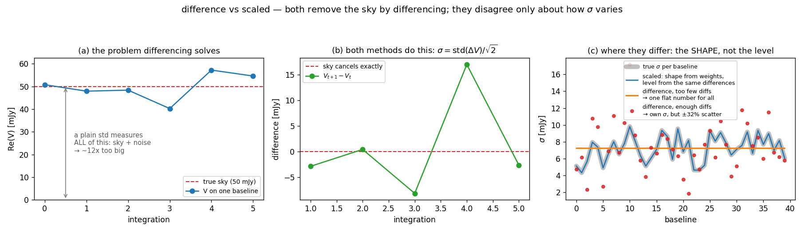
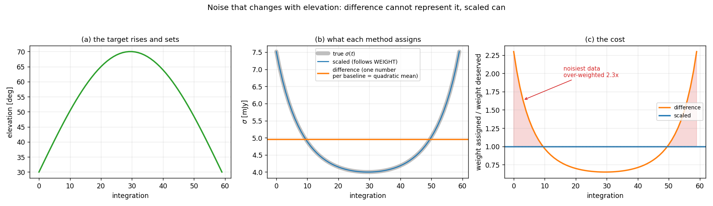
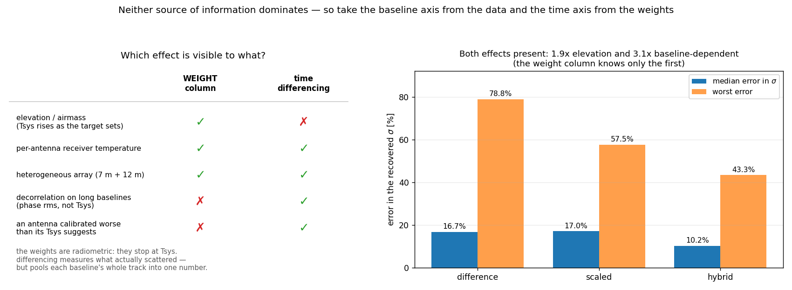

# Noise estimation

The short version is in the [README](../README.md): pyuvimage measures the
noise from the visibilities and does not use the MS weights for it. This is the
long version — why, what the alternatives are, and how to tell which your data
wants.

## Why the weight column is not used for the scale

`SIGMA` is *defined* as absolute — the CASA memo on data weights gives
`SIGMA = 1/√(2 Δν Δt)`, with `WEIGHT = 1/SIGMA² = 2 Δν Δt` — but that only
holds if the calibration actually put it on that scale. In practice a pipeline
sets weights **proportional** to the true inverse variance without being equal
to it (Tsys weighting fixes the ratios, not the units), and every `split`,
`mstransform` or averaging step recomputes them. `statwt` exists because the
column drifts. So it is nominally absolute and practically relative, which is
the worst combination: it looks trustworthy.

That matters more here than in CLEAN. CLEAN's stopping threshold is set by the
user in Jy/beam, so a mis-scaled weight column mostly costs it some sensitivity
weighting. In pyuvimage everything downstream of σ scales with it — χ², the
discrepancy criterion that chooses how much to smooth, and every number in
`uncertainty.fits` — so it silently changes the answer.

On the first real dataset this was tried on, σ was inflated 1.4×. The
discrepancy principle duly stopped at χ²/N = 1 when the true value was 0.52,
and the entire Einstein ring stayed in the residual map at 26.8σ.

Reference: [CASA memo on data weights](https://casa.nrao.edu/Memos/CASA-data-weights.pdf).

## What differencing does instead

Difference two visibilities adjacent in time on the same baseline. The sky is
the same in both, so it cancels exactly and what remains is noise with variance
2σ². A plain standard deviation of the visibilities would measure the source as
well — on a source 12× the noise it comes out ~650% high, which would
over-smooth every fit.



Two guards matter:

**Adjacency.** A difference is only meaningful between samples close in time.
Across a calibrator visit — 30–40% of a typical ALMA execution — the earth has
turned a long baseline through several kλ, so the difference measures the
source. `auto_max_gap` drops pairs separated by more than **3 × the median time
step**, which adapts to whatever the data was averaged to: 6 s integrations with
90 s calibrator gaps gives an 18 s threshold, while four irregular timestamps
spanning 260 s gives 272 s and nothing is dropped. If the guard would leave
nothing to work with, the estimate is redone without it and warns.

**Pooling.** Fewer than `MIN_DIFFS = 4` differences and a baseline's own σ is
mostly noise itself, so it takes the pooled value instead — but its differences
still join the pool. Getting that backwards was a real bug: a four-timestamp MS
skipped every baseline *before* pooling, emptied the pool, and fell through to
the robust scatter of the visibilities, which is a measurement of the source.

## Resolving the noise in time

The noise is not stationary. As the target rises and sets, airmass and Tsys go
with it, and σ can change by ~1.9× between transit and the ends of a 30→70°
track. One σ per baseline for the whole observation is the quadratic mean of
σ(t), which hands the noisiest data ~2.3× more weight than it deserves.



`--noise difference` therefore resolves σ into blocks of the track
(`--noise-chunk`, default 600 s) wherever there are enough integrations, and
collapses to one σ per baseline wherever there are not — the two are the same
mode because a block as long as the track *is* the pooled estimate. Where a
baseline has too few differences inside a block it falls back to a separable
estimate: its whole-track σ scaled by that block's level pooled over all
baselines, which is always well determined.

### Choosing `--noise-chunk`

The binding constraint is how much target time exists to divide. A typical ALMA
execution is 1–1.5 h *including* calibrator visits, so the target gets roughly
45–60 minutes. 600 s leaves 5–6 blocks of that.

Median error in σ on a simulated 75-minute execution with interleaved
calibrators (48 min on source), carrying elevation-driven Tsys *and*
decorrelation correlated with it:

| chunk | 300 s | 450 s | **600 s** | 900 s | 1200 s | 1800 s | (pooled) |
|---|---|---|---|---|---|---|---|
| 6 s integrations | 7.9% | 7.1% | **7.1%** | 8.1% | 8.2% | 10.7% | 22.4% |
| 30 s | 15.5% | 14.6% | **13.9%** | 12.7% | 12.2% | 14.2% | 22.1% |
| 60 s | 13.5% | 14.4% | **16.8%** | 18.0% | 17.3% | 18.3% | 26.0% |

Too short and each σ comes from too few differences (the error on a σ from `n`
differences is about `1/√(2n)`); too long and there is no time resolution left.
`--noise-chunk 0` forces one σ per baseline everywhere.

## The alternatives, and when they help

The weight column and time-differencing are blind on **different axes**.



The weight column is *radiometric*: Tsys, bandwidth, integration time, flagged
fraction. It knows the time axis exactly, plus per-antenna receiver temperature
and a heterogeneous array. It cannot know anything downstream of the
radiometry — **decorrelation**, which grows with baseline length because the
atmosphere loses coherence faster over longer separations, or an antenna
calibrated worse than its Tsys suggests. Two baselines with the same Tsys look
identical to it.

Differencing is the reverse: honest along the baseline axis, and it has to
spend differences to resolve the time axis.

| `--noise` | shape from | when it helps |
|---|---|---|
| **`difference`** (default) | the data | almost always; uses no weights at all |
| `hybrid` | baseline level from the data, time profile from the weights | too few integrations per block to measure the time dependence, but the weights still carry it |
| `scaled` | the weight column, whole shape; scale still from the data | too few differences to measure even the per-baseline level |
| `sigma` | the weight column, shape *and* scale | essentially never — it warns |

With both effects present at once (1.9× elevation variation, 3.1× of
baseline-dependent decorrelation, weights knowing only the first), the median
error in σ was 16.7% for pooled differencing and 17.0% for `scaled`: neither
dominates. Taking each axis from the source that can see it gave 10.2%.

`hybrid` cannot do worse than `difference` — if the weights carry no time
dependence its profile is flat and the two coincide — but it does assume the
column's ratios are right, and a scrambled shape is not rescued.

## The diagnostics

Rather than leaving the choice to this document, every import measures which
regime your data is in.

**Weight-vs-data scale**, always logged:

```
noise check: MS weights imply median sigma 5.111e-03 Jy,
time-differenced visibilities give 3.696e-03 Jy (ratio 1.383)
```

A disagreement here is normal — that is the point of recomputing — and is only
a problem if you were about to use `--noise sigma`.

**Baseline-length disagreement**, comparing the differenced σ against the
column's claim quartile by quartile in baseline length:

```
WARNING: the long baselines are 1.47x noisier than the weight column
claims, relative to the short ones -- decorrelation or calibration
quality, which the weights cannot see because they are purely
radiometric. --noise scaled would discard that.
```

**Time variation**, pooling the differences into thirds of the track. The
reported ratio is a lower bound, since each third averages over its own span:

```
WARNING: the noise level changes by at least 1.30x over the track
(thirds: 6.92, 5.32, 6.92 mJy) -- elevation and Tsys, most likely.
```

Reading them: the first fires → stay off `scaled`. The second fires and you are
using `--noise-chunk 0` → let it chunk, or use `hybrid`. Neither fires → the
default is doing everything there is to do.

## Changing the estimate later

The estimate is made when the data leaves the measurement set and stored in the
dataset; `pyuvimage fit` never recomputes it, so a fit costs the same however
the noise was derived.

The choice is not frozen there, though. Datasets carry `antenna1`, `antenna2`,
`time` and — where the MS had them — the weight column's relative sigma, so any
estimator can be applied afterwards:

```bash
pyuvimage convert export.npz mydata/ --noise hybrid
```

recomputes and **stores the result**, so no later run pays for it again.
`--noise keep` (the default) leaves the map the export already wrote.
`uvdata.recompute_noise(dataset, mode, chunk_seconds)` is the same thing in
Python.

This exists because it was once impossible: when the first real dataset turned
out to carry a noise map that measured the source, the only repair was to go
back to the measurement set.

A dataset written by an older export has no antenna or time columns and will
say so rather than guessing; `hybrid` and `scaled` refuse rather than improvise
when there is no weight column.

## Which path computes what

`casa_export.py` runs inside CASA and carries its own copy of the estimator, so
it offers `difference` only — but it stores everything needed to change the
mode at `convert` time. `pyuvimage import` (which needs python-casacore) offers
all of them directly. Both apply the adjacency guard and print the diagnostics.

`WEIGHT_SPECTRUM` is used when present, for both the Stokes I average and the
noise shape; without it every channel in a row shares one weight, which is
wrong at the edges of any real spw.
