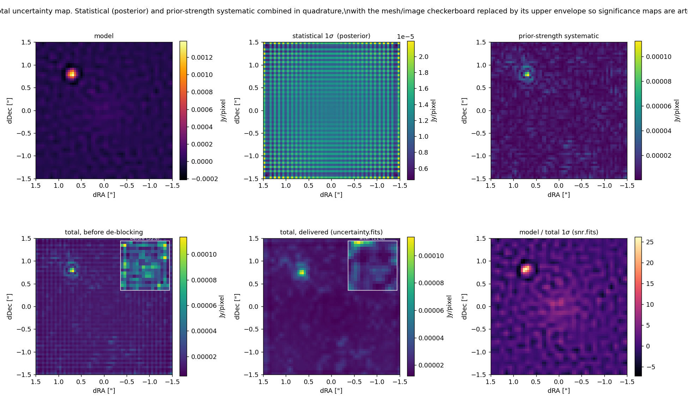

# Uncertainty maps, in full

[← back to the README](../README.md)

**Choosing what is computed (`--uncertainty`).** Off by default (`none`).
`statistical` writes the posterior width at the fitted prior strength;
`systematic` adds the prior-strength systematic described below;
`bayesian` writes the posterior marginalised over the prior strength, with
the evidence as its weight (`SingleFit.bayesian_posterior`), together with
`model_bayesian.fits`, the posterior mean those errors belong to. The header
key `ERRTYPE` says which. What each is worth is in "Caveats on the prior
systematic" at the end: on the demo mocks only `bayesian` is close to
calibrated at low S/N, and on REBELS-25 the three agree.

For `systematic`, two maps, in Jy/pixel: `uncertainty.fits`, the total 1σ
per pixel, and `uncertainty_systematic.fits`, the prior-systematic part of
it on its own (same header). The second exists because that part is the least
certain piece of the budget — see "Caveats on the prior systematic" below —
and a reader should be able to see how much of the total it makes up, and to
drop or rescale it. **It is not the denominator of a significance map.** On a model
sampled finer than the beam neighbouring pixels are strongly anticorrelated:
each one is poorly determined while their sum is not. On REBELS-25 (0.03"
pixels, 0.24" beam) `model / uncertainty` peaked at ~3 on a 14.5σ source, and
on a 40σ mock disc at 12.6.

**`snr.fits` is S/N at the restoring beam's resolution** (`SingleFit.beam_snr`):
the model convolved with the restoring beam — the restored image without its
residuals, in Jy/beam — over the 1σ of *that smoothed model*. The statistical
part is propagated from the full posterior covariance, sqrt(diag(K M C Mᵀ Kᵀ))
(`smoothed_std`), never by smoothing the per-pixel error map; the prior
systematic is the largest change of the smoothed model across the same
measured window as `uncertainty.fits`. With point components the points are
added as the restoring beam at their fitted positions, and the error uses the
joint covariance of mesh and amplitudes, whose cross-term is negative (a
point and the mesh beneath it trade flux). On the mock disc it peaks at 40.8
against a true 39.3 and 9.6 → 11.1 at a quarter of the brightness, with the
3σ and 5σ contours where the truth puts them; on REBELS-25 the peak is 10
(`figures/snr_maps_mock.png`, made by `scripts/figure_snr_maps.py`). Where the
prior systematic dominates — the slope of a bright compact source, which moves
most with the prior strength — the map dips, honestly: 18σ against a true 27σ
at 0.25″ from the peak of the bright mock. The header carries the beam it
refers to.

**For a number to quote, use a region.** Every run reports
one: `source_flux` in `fit_parameters.json`, and a line in the log — the flux
inside the region where the model convolved with the restoring beam exceeds
3× the rms, with its statistical error from the full posterior covariance
(`SingleFit.aperture_uncertainty`) and its prior systematic across the same
window as the map (`aperture_systematic`).

**What goes into it.** Two terms, added in quadrature, with the medians of
each written to the FITS header so you can see the split without recomputing
anything:

| term | header key | what it is | how it is obtained |
|---|---|---|---|
| statistical | `ERRSTAT` | how well the data pin this pixel down, given the prior | `sqrt(diag(M C M^T))` with `C = (F+H)^-1`, the closed-form posterior covariance |
| prior systematic | `ERRSYS` | how much the answer depends on *how strongly* you smoothed | how far the pixel moves when the regularisation strength is varied over the range the data cannot distinguish |
| | `ERRWLO`, `ERRWHI` | (record that range, in dex either side of the fitted strength) | |
| | `ERRWMEA` | (`T` if the range was measured, `F` if a fixed window was asked for) | |
| | `ERRWMET` | (what the range was measured in: `chi^2` or `structure ratio`) | |
| | `ERRDEBL` | (records that the checkerboard was removed) | |

Rule of thumb from the mocks: the statistical term dominates in smooth
extended emission, the systematic dominates on compact features — which is
exactly where the prior is doing the most work and where a purely statistical
error bar would mislead you. On the demo the medians are 1.7e-6 and 1.0e-6
Jy/pixel respectively.

In detail:

**Statistical.** The inversion is linear with a Gaussian prior, so the
posterior covariance is closed-form, `C = (F + H)^-1`, propagated to the image
grid as `sqrt(diag(M C M^T))` — not by copying per-mesh-pixel errors across,
since the mapper interpolates and neighbouring mesh errors are correlated. The
noise-only part of this, `(F+H)^-1 F (F+H)^-1`, was verified at **0.996**
(matern) and **0.995** (gibbs) against 30-realisation Monte Carlos.

**Prior systematic.** `C` contains no data and is conditional on one prior at
one strength, which makes it optimistic: a regularised model is smoothed, so
it is biased, and on the extended+compact mock the smoothing bias is ~2.8x the
random scatter. The systematic term measures how far each pixel moves when the
regularisation strength is varied — the same construction used for
point-source fluxes, where it turned pulls of up to 24σ into pulls under 3. It
concentrates where it should: around compact features, where the prior is
doing the most work.

**How far to vary it is measured, not assumed** (`SingleFit.chi2_admissible_dex`).
The window is the set of strengths the data cannot tell apart: those whose χ²
is within one σ(χ²) = √(2N) of the fitted strength's, found by walking outward
in half decades. It is floored at ±0.5 dex — the walk cannot resolve a reach
finer than one step, and this is the fixed window the method used before — and
capped at ±6 dex, by which point the model no longer resembles the data.

**When `structure` chose the strength, the window is measured in the
structure ratio instead.** `--criterion auto` picks `structure` precisely
because χ² has gone flat, and a flat χ² then declares every strength
admissible. On REBELS-25 (3×10⁶ data points) χ² moved by less than 400 across
twelve decades against σ(χ²) = 2442: the window opened to ±6 dex, the
strongest prior in it had smoothed the source away, the systematic equalled
the model everywhere, and `snr.fits` never exceeded 1.3 on a 15σ source. Over
the same range the structure ratio went 0.80 → 1.48. So a `structure` fit's
window is the set of strengths whose structure ratio is within its own noise
scatter of the fitted one, σ(ratio) = √(Σ beam² / 2 n_pixels)
(`structure_ratio_scatter`; checked against 300 noise realisations on three
mocks to 10%). On REBELS-25 that is 0.027 and the window is ±0.5 dex. A fit
that fell back from `structure` to `discrepancy` is in the weakly constrained
regime where the ratio is not calibrated, and keeps the χ² window.

**And the window is sampled, not just its edges.** A pixel's deviation is not
monotonic in the scale factor: the model with the prior turned up to nonsense
is not "further from" the fitted one everywhere than the model half a decade
away. Taking only the two edges therefore let a *wider* window report a
*smaller* systematic — across 32 mock configurations, 7 did, by up to 20% of
the peak — which would have made the measured window worse than the fixed one
it is meant to subsume. So every half-decade step the walk accepted is
evaluated and the pixel-wise maximum taken over all of them; the floor's
endpoints are always in that set, which is what makes "measured ≥ fixed, pixel
by pixel" a property rather than a tendency. The solves are the walk's own, so
this costs one mesh→image mapping per step, not one solve.

A fixed window assumes the admissible range of strengths is the same whatever
the data, and it is not. On a weakly constrained fit the prior takes over, χ²
stops responding to the strength, and the model can be orders of magnitude
away with no χ² penalty — while the *statistical* term shrinks, because a
strong prior shrinks the posterior variance. The quoted error then falls as
the data get worse, which is exactly backwards. Measured on the demo mock down
a 60× range in noise, comparing the quoted 1σ against the actual rms error
(coverage = actual / quoted, >1 means the map under-states the error):

| peak S/N | measured window | coverage, fixed ±0.5 dex | coverage, measured |
|---|---|---|---|
| 300 | ±0.5 | 0.73 | 0.73 |
| 132 | ±0.5 | 0.71 | 0.71 |
| 58 | ±0.5 | 0.67 | 0.67 |
| 26 | ±1.5 | 0.72 | 0.59 |
| 11 | −5.0/+1.5 | **1.91** | 0.50 |
| 5 | ±6.0 | **9.64** | 1.23 |

Because of the floor the two are identical wherever the fit is well
constrained; the window only ever opens. The cost is the walk: 4 extra solves
of the n_mesh system on a well-constrained fit, at most 24 on one χ² barely
responds to — no transforms and no refit — plus one mesh→image mapping per
accepted step. On a non-negative fit each step is seeded from the previous
one's support, which is what keeps a constrained walk affordable: on a
50×50 mesh a weakly regularised fit opened the window to ±6 dex and made all
24 solves in 26 s seeded, against roughly 35 s *per solve* cold (see
"Where the time goes" in design-notes.md). Passing
`model_uncertainty_total(0.5)` restores a fixed window if you want the old
number.

**What it still misses.** It does not cover the prior *family* being wrong,
nor calibration or deconvolution error, and it does not cover the smoothing
bias *at* the fitted strength: on the extended+compact mock, where a resolved
knot sits on a smooth disc, the total under-states the rms error on source
pixels by ~4× at high S/N whichever window is used, because moving λ within
the admissible range does not move the model but the model is biased anyway.
Treat the map as a floor on the error near compact structure, not a complete
account of it. Nothing cheap fixes this.

**The checkerboard is removed.** Products live on a grid `oversample`× finer
than the model mesh, and the mapper interpolates: a pixel on a mesh node
inherits one mesh pixel's variance, a pixel between nodes is a weighted average
of several and has a genuinely smaller one. Both numbers are right, but the
alternating pattern is an artefact of the two grids and it lands straight in
any significance map — measured at **55%** peak-to-peak within a block on the
test mock. The delivered map replaces it with its upper envelope (a block
maximum, then a block mean), bringing it to **11%**. This is deliberately the
conservative direction: an over-stated error never manufactures a detection.
`ERRDEBL` records that it was done.

**Why the map looks the way it does.** With the prior held fixed the
statistical term is *identical* for completely different datasets (verified to
exactly zero difference) and **cannot respond to how bright the source is**.
Its structure comes from the uv coverage and noise (through `F`), the prior
(through `H`), and the mask edges. A **stationary** prior (`matern`,
`exponential`) makes both translation-invariant and the term is flat by
construction — a featureless matern map is the correct answer, not a bug. A
**non-stationary** prior (`gibbs`, `adaptive`, `gaussian`) varies: on the
extended+compact mock the gibbs map peaks 5x its median at the unresolved knot,
with a 6x range across the field, and the Monte Carlo reproduces that
structure. The knot has the *larger* error bar because the prior is
deliberately weakest there. The systematic term, by contrast, does respond to
the source — it is a difference of two fits.

**Do not add per-pixel errors in quadrature.** The covariance is strongly
correlated over the prior's correlation length. Use
`SingleFit.aperture_uncertainty(region)`, which evaluates `w^T (M C M^T) w`
properly. On our mock quadrature *overstates* a compact aperture's error by
~1.4x.

Everything above is conditional on the noise map being right and on the fitted
hyperparameters; it does not include the uncertainty in those.

## Caveats on the prior systematic

The statistical term is well defined: it is the posterior width *given* the
prior and its strength, and it was checked against Monte Carlo to 0.5%. The
prior systematic is not a posterior quantity. It is a heuristic answer to
"how much does the result depend on how strongly we smoothed?", and its size
depends on choices that the data do not fix. Report the two terms separately
(`ERRSTAT`/`ERRSYS`, `uncertainty_systematic.fits`, and the stat/sys split of
`source_flux` in `fit_parameters.json`), and treat the systematic as an
indication rather than a calibrated 1σ. What we know about it (Oct 2026; the
numbers are from `scripts/figure_snr_series.py` and
`scripts/test_structure_window.py`):

- **Its size is set by the window rule, and the rule is a choice.** For a
  `discrepancy` fit the window is where χ² stays within √(2N); for a
  `structure` fit, where the structure ratio stays within
  `STRUCTURE_WINDOW_N_SIGMA` × its noise scatter (default 1). Neither is a
  posterior on the strength. On REBELS-25 the χ² rule gives ±6 dex and the
  structure rule ±0.5 dex on the same fit; the source-flux S/N is ~1 with the
  first and 14.5 with the second.
- **The structure window does not open at low S/N.** The structure ratio
  barely responds to the strength when the data are weak (0.78 → 1.12 over
  ±6 dex on the demo at 5σ, against 0.49 → 7.1 at 300σ), so at the default
  tolerance the window stays at its ±0.5 dex floor. On the demo mock the quoted
  1σ then falls ~10× short of the actual error at a peak S/N of 5, and below
  it from ~20σ down. A tolerance of 5× the scatter brings the mock's quoted
  error above the actual error at every S/N, leaves the bright real datasets
  unchanged (J0116 and J1446: source-flux S/N 51 and 49 either way), and
  roughly triples the error on the faint ones (REBELS-25: S/N 14.5 → 5.4). It
  is under test, not the default.
- **It cannot see the smoothing bias at the fitted strength.** The structure
  criterion over-smooths at low S/N: on the demo the strength closest to the
  truth is 0.5–1.5 dex weaker than the one chosen, and the recovered extended
  flux falls from 0.93 of the truth at 58σ to 0.27 at 5σ. Varying the
  strength around the chosen value measures sensitivity, not this bias; an
  error bar wide enough to cover it there has to come from somewhere else.
- **Positivity inflates it at weak priors.** Non-negative solves at weak
  priors keep the positive noise excursions and drop the negative ones, so
  flux is added from noise; on REBELS-25 the source-region flux moves by up to
  65% across the weak side of the window. Measuring the window with
  unconstrained solves does not help — they fit the noise instead.
- **Other codes mostly leave it out.** PyAutoArray's
  `reconstruction_noise_map` is √diag((F+H)⁻¹) at a fixed coefficient; in
  PyAutoGalaxy/PyAutoLens the coefficient is a sampled model parameter, so
  quantities computed per sample are marginalised over it, but the per-pixel
  noise map is not. Suyu et al. (2006) treat the strength as a delta function
  and note that the resulting errors understate the error against the truth.
  The EHT (2019, Paper IV) quote the spread over a "top set" of regulariser
  weights validated on synthetic data and say explicitly that it is not a
  posterior — the closest analogue of what is done here.
- **Marginalising over the strength does not fix it either.** For one
  hyperparameter the posterior on log λ is the evidence on a grid, and the
  image posterior marginalised over it follows from the law of total variance
  (`scripts/marginal_lambda_mock.py`; no sampler is needed in one dimension).
  On the demo series the posterior on log₁₀ λ is only 0.07–0.28 dex wide and
  the spread between strengths adds ≤1% to the variance. What does improve
  the low-S/N error bars is *where* the evidence puts λ: 1–1.4 dex weaker
  than `structure`, close to the strength nearest the truth. With the
  unconstrained posterior at the evidence optimum, the fraction of source
  pixels whose error lies within the quoted 1σ is 0.57–0.71 at peak S/N ≤ 58
  (0.68 if calibrated) against 0.02–0.35 for the shipped `structure` fit, and
  the recovered extended flux is 0.72–0.98 against 0.27–0.93. At high S/N
  every version under-covers (≈0.5), from resolution, not from λ.
- **Better-founded alternatives, not yet implemented.** MacKay (1992) gives
  the width of the posterior on the strength, σ(ln λ) ≈ √(2/γ) with γ the
  effective number of well-determined parameters, which would set the window
  from the fit itself; and the residual-based literature (Rust & O'Leary 2008;
  Hansen et al. 2006) shows the expected residual of a correctly regularised
  fit is *below* the raw noise, which suggests the structure ratio's target
  should be below 1 (≈0.9 on the demo) — removing much of the bias above.
